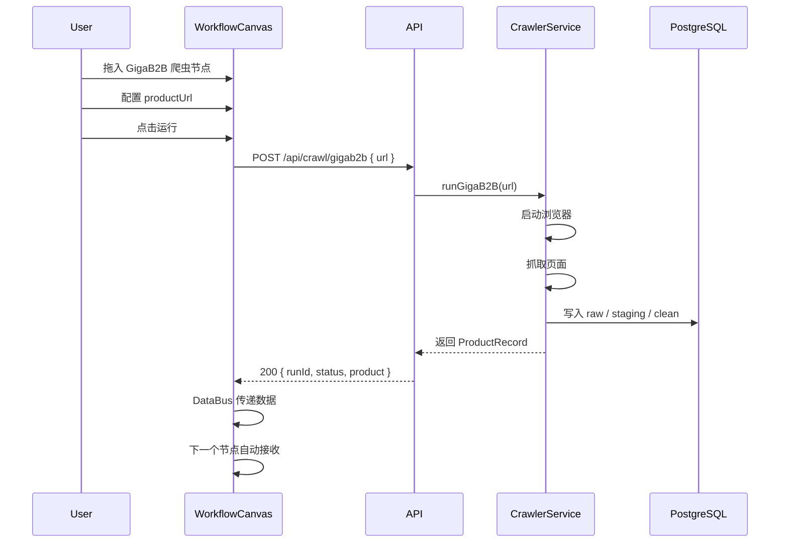

# 爬虫数据管道接入工作流编辑器 — 完整设计方案

> 文档版本: v1.0
> 更新日期: 2026-04-28
> 涉及项目:
>   - 爬虫系统: `/node_plawright_test/quick-test/`
>   - 工作流编辑器: `/chatgpt_pages/implementations/dashboard/workflow-editor/`

---

## 目录

1. [背景与目标](#1-背景与目标)
2. [现有架构回顾](#2-现有架构回顾)
3. [接入架构设计](#3-接入架构设计)
4. [数据流程](#4-数据流程)
5. [API 接口设计](#5-api-接口设计)
6. [工作流节点设计](#6-工作流节点设计)
7. [实现步骤](#7-实现步骤)
8. [文件变更清单](#8-文件变更清单)
9. [测试验证方案](#9-测试验证方案)
10. [附录：数据流图](#10-附录数据流图)

---

## 1. 背景与目标

### 1.1 业务背景

现有的跨境电商商品采集流程中，爬虫系统独立运行（CLI 脚本），与工作流编辑器没有打通。用户需要：

1. 在工作流编辑器中**可视化编排**爬虫流程
2. 爬虫抓取的**数据结构化存储**，供后续节点使用
3. 每个环节的**中间数据可追溯**（raw → staging → clean）
4. 支持**人工校验节点**介入修正数据

### 1.2 目标

- 将 `CrawlerService` 封装为可被工作流引擎调用的 HTTP API
- 在工作流编辑器中注册爬虫节点，与现有 AI 优化、Webhook 等节点串联
- 保持三层数据分离（raw / staging / clean），每层可通过工作流节点访问

### 1.3 成功标准

1. 工作流画布上拖拽"GigaB2B 爬虫"节点 → 配置 URL → 执行 → 输出结构化数据
2. 输出数据可以被下一个节点（如 AI 优化）消费
3. 数据库和文件系统三层数据完整可查
4. 执行过程在日志面板可见

---

## 2. 现有架构回顾

### 2.1 爬虫系统架构

```
src/
├── core/                          # 基础设施层
│   ├── types.ts                   #   共享类型 (CrawlerRun, ProductRecord)
│   ├── run-context.ts             #   运行生命周期 (RunContext)
│   └── database-service.ts        #   PostgreSQL 读写 (DatabaseService)
├── crawlers/                      # 爬虫实现层
│   ├── base-crawler.ts            #   抽象基类 (BaseCrawler)
│   └── gigab2b/
│       ├── config.ts              #   类型定义 (GigaB2BConfig/Staging/Clean)
│       ├── extractor.ts           #   DOM 数据提取 (GigaB2BExtractor)
│       ├── cleaner.ts             #   数据清洗 (GigaB2BCleaner)
│       └── crawler.ts             #   爬虫主类 (GigaB2BCrawler)
├── services/
│   └── crawler-service.ts         # 服务编排层 (CrawlerService)
└── scripts/
    └── run-gigab2b.ts             # CLI 入口
```

**核心类 `CrawlerService.runGigaB2B(url, options)`：**

| 步骤 | 操作 | 产出 |
|---|---|---|
| 1 | 创建 RunContext | `runId`, 本地目录结构 |
| 2 | 打开浏览器 | Playwright Chromium |
| 3 | 导航到产品页 | `raw/page.html` + DB raw_data |
| 4 | DOM 提取 | `staging/data.json` + DB staging_data |
| 5 | 清洗数据 | `clean/product-ready.json` + DB clean_products |
| 6 | 完成运行 | `run.json` status=completed |

### 2.2 工作流编辑器架构

```
src/
├── engine/
│   ├── pluginTypes.ts           # NodePlugin 类型定义
│   ├── pluginRegistry.ts        # 插件注册中心
│   ├── WorkflowEngine.ts        # 工作流引擎（顺序执行 step 节点）
│   ├── types.ts                 # NodeExecutor, NodeContext 定义
│   ├── DataBus.ts               # 节点间数据传递
│   └── mockExecutors/           # Mock 执行器（现用）
│   └── realExecutors/           # 真实执行器
├── plugins/
│   └── index.ts                 # 所有插件注册入口
├── components/
│   ├── Canvas.tsx               # 工作流画布
│   ├── WorkflowNode.tsx         # 节点渲染
│   ├── ConfigPanel.tsx          # 节点配置面板
│   └── NodePanel.tsx            # 左侧节点面板
└── pages/
    ├── WorkflowPage.tsx         # 工作流页面
    └── ...其他页面
```

**核心接口 `NodeExecutor.execute(ctx: NodeContext)`：**

```typescript
interface NodeContext {
  nodeId: string;
  config: Record<string, unknown>;      // 用户配置
  input: Record<string, unknown>;       // 上游节点输出
  logger: (level, message) => void;
  abortSignal: AbortSignal;
}

interface NodeExecutor {
  type: string;
  inputSchema: Record<string, FieldDef>;
  outputSchema: Record<string, FieldDef>;
  configSchema: Record<string, FieldDef>;
  execute(ctx: NodeContext): Promise<Record<string, unknown>>;
}
```

**节点执行流程（WorkflowEngine）：**

```
start → step[0].execute(input={}) → output
                                  → step[1].execute(input=step[0].output) → output
                                                                          → step[2].execute(...) → ...
```

**现有真实执行器示例：**

| 执行器 | 类型 | 实现方式 |
|---|---|---|
| `claudeOptimizeExecutor` | `ai` | 前端直接 `fetch()` 调 Claude API |
| `webhookExecutor` | `data` | 前端 `fetch()` 调外部 webhook |

---

## 3. 接入架构设计

### 3.1 总体架构

```
┌─────────────────────────────────────────────────────────┐
│                   浏览器 (Frontend)                       │
│                                                         │
│  Workflow Canvas                                        │
│    │                                                     │
│    ├── 节点: GigaB2B 爬虫                                 │
│    │     ├── config: { productUrl }                      │
│    │     ├── execute() → fetch(POST /api/crawl)          │
│    │     └── output: { productId, title, price, ... }    │
│    │                                                     │
│    ├── 节点: AI 优化文案 (已有)                             │
│    │     ├── input: { title, description }              │
│    │     ├── execute() → fetch(Claude API)               │
│    │     └── output: { optimizedTitle, ... }             │
│    │                                                     │
│    └── 节点: 数据查看                                     │
│          ├── execute() → fetch(GET /api/runs)            │
│          └── output: { runs: [...] }                     │
│                                                         │
└──────────┬──────────────────────────────────────────────┘
           │ HTTP (fetch)
           ▼
┌─────────────────────────────────────────────────────────┐
│                   API 服务器 (Node.js)                    │
│                                                         │
│  POST /api/crawl  →  CrawlerService.runGigaB2B()        │
│  GET  /api/runs   →  DatabaseService.listRuns()         │
│  GET  /api/runs/:id →  DatabaseService.getRunData()     │
│                                                         │
│  ┌─────────────────────────────────────────────┐        │
│  │  CrawlerService                              │        │
│  │  ├── RunContext (文件: output/runs/...)       │        │
│  │  ├── DatabaseService (PostgreSQL)            │        │
│  │  └── Playwright (Chromium 浏览器)            │        │
│  └─────────────────────────────────────────────┘        │
└─────────────────────────────────────────────────────────┘
```

### 3.2 为什么不走 Mock 直接调爬虫

现有 mock executor 直接在前端 `fetch()` 调外部 API。爬虫系统也应该走同样的模式：

| 方案 | 优点 | 缺点 | 结论 |
|---|---|---|---|
| 前端直接 import 爬虫代码 | 无网络开销 | 爬虫依赖 Node.js API (fs, child_process)，浏览器无法运行 | ❌ |
| 前端调后端 API | 与现有 webhookExecutor 模式一致 | 需要维护一个 API 进程 | ✅ |
| 通过 IPC 调本地进程 | 跨项目调用 | 复杂度高，耦合紧 | ❌ |

### 3.3 部署模式

**开发环境：**
```
终端 1: docker-compose up -d          # PostgreSQL
终端 2: npx tsx src/api-server.ts      # API 服务 (端口 3456)
终端 3: cd workflow-editor && npm run dev  # Vite 前端 (端口 5173)
```

**前端 Vite 配置代理：**
```typescript
// vite.config.ts
server: {
  proxy: {
    '/api': 'http://localhost:3456'
  }
}
```

---

## 4. 数据流程

### 4.1 完整数据流

```
Step 1: 用户在工作流画布拖入"GigaB2B 爬虫"节点
        │
        ├── 配置: { productUrl: "https://gigab2b.com/.../product_id=747431" }
        │
        ▼
Step 2: 点击"运行"，WorkflowEngine 调用 executor.execute()
        │
        ├── executor.buildRequest() → { url, config }
        ├── fetch(POST /api/crawl, { url, saveToDb: true })
        │
        ▼
Step 3: API 服务器调用 CrawlerService.runGigaB2B()
        │
        ├── 1. 创建 RunContext → runId: "gigab2b-20260428-xxxxxx"
        │       └── output/runs/{runId}/ 目录创建
        │
        ├── 2. 启动 Playwright Chromium (headless)
        │       └── Chrome 临时 profile (系统 tmp 目录)
        │
        ├── 3. 导航到 productUrl
        │       ├── page.goto(url, { waitUntil: 'domcontentloaded' })
        │       ├── 保存 raw → output/runs/{runId}/raw/page.html
        │       └── 保存 raw → PostgreSQL raw_data 表
        │
        ├── 4. 点击 Product Info 标签（如果存在）
        │       └── page.locator('#tab-description').click()
        │
        ├── 5. 提取数据
        │       ├── DOM 选择器: h1 / .price / .product-description
        │       ├── Playwright 遍历: #pane-description .items span
        │       ├── 图片过滤: src 含 b2bfiles 且非 HDFlags/icon
        │       ├── 保存 staging → output/runs/{runId}/staging/data.json
        │       └── 保存 staging → PostgreSQL staging_data 表
        │
        ├── 6. 清洗数据
        │       ├── title: trim(), 合并多余空格
        │       ├── price: 去除非数字字符, 提取纯数值
        │       ├── externalId: URL 正则 product_id=(\d+)
        │       ├── currency: 补充 "USD"
        │       ├── images: 去重, 去 query string
        │       ├── 保存 clean → output/runs/{runId}/clean/product-ready.json
        │       └── 写入 clean → PostgreSQL clean_products 表 (UPSERT)
        │
        ├── 7. 关闭浏览器
        ├── 8. 更新 run.json → status: "completed"
        ├── 9. 更新 PostgreSQL → crawler_runs 表 status: "completed"
        │
        ▼
Step 4: API 返回给前端
        │
        ├── Response body:
        │   {
        │     "runId": "gigab2b-20260428-xxxxxx",
        │     "status": "completed",
        │     "product": {
        │       "externalId": "747431",
        │       "title": "Modern Fabric Sofa Couch",
        │       "price": "599.00",
        │       "currency": "USD",
        │       "images": [...18张...],
        │       "specifications": { "Material": "...", "Color": "..." }
        │     }
        │   }
        │
        ▼
Step 5: 前端 WorkflowEngine 收到 output
        │
        ├── DataBus.setOutput(nodeId, output)
        ├── 画布上节点显示绿色 (success)
        ├── 日志面板显示: "完成: externalId: 747431, title: Modern..."
        │
        ▼
Step 6: 下一个节点（如 AI 优化）收到 input
        │
        ├── input.title = "Modern Fabric Sofa Couch"
        ├── input.description = "A comfortable 2-seater sofa..."
        └── 继续执行 AI 节点...
```

### 4.2 三层数据结构对照

| 层级 | 存储位置 | 表/文件 | 字段 | 示例 |
|---|---|---|---|---|
| **Raw** | 文件 | `output/runs/{id}/raw/page.html` | 完整的 HTML | `<!DOCTYPE html>...` |
| | DB | `raw_data.content` | TEXT | 同上 |
| | DB | `raw_data.url` | TEXT | `https://gigab2b.com/...` |
| **Staging** | 文件 | `output/runs/{id}/staging/data.json` | JSON（保留原始格式） | `{ "title": "  abc  " }` |
| | DB | `staging_data.data` | JSONB | 同上 |
| **Clean** | 文件 | `output/runs/{id}/clean/product-ready.json` | JSON（规范化） | `{ "title": "abc" }` |
| | DB | `clean_products` | 表（结构化字段） | 见下方表格 |

**`clean_products` 表字段映射：**

```
URL product_id  → external_id (unique per source)
title (trimmed) → title
price (numeric) → price
$ → USD         → currency
src[]           → images (TEXT[])
键值对           → specifications (JSONB)
```

### 4.3 工作流节点间数据传递

```
节点 A (GigaB2B爬虫) 输出:
{
  "runId": "gigab2b-20260428-xxxx",
  "externalId": "747431",
  "title": "Modern Fabric Sofa Couch",
  "price": 599.00,
  "currency": "USD",
  "description": "A comfortable 2-seater sofa...",
  "images": ["url1.jpg", "url2.jpg", ...],
  "specifications": { "Material": "Fabric", ... }
}
         │
         ▼  DataBus 传递给下一个节点
         │
节点 B (AI 优化文案) 输入 (inputSchema):
{
  "title": { "type": "string" },          ← 从 A 的 title 自动匹配
  "description": { "type": "string" }      ← 从 A 的 description 自动匹配
}
```

匹配规则：**字段名相同则自动传递**。`inputSchema` 声明需要 `title`，上游输出有 `title`，引擎自动注入。

---

## 5. API 接口设计

### 5.1 接口列表

| 方法 | 路径 | 用途 | 请求体 | 响应体 |
|---|---|---|---|---|
| POST | `/api/crawl/gigab2b` | 执行 GigaB2B 爬虫 | `{ url: string }` | `{ runId, status, product }` |
| GET | `/api/runs` | 列出运行记录 | query: `?limit=20` | `CrawlerRun[]` |
| GET | `/api/runs/:id` | 获取单次运行数据 | - | `{ run, staging, clean[] }` |
| GET | `/api/health` | 健康检查 | - | `{ status: "ok" }` |

### 5.2 接口详细定义

#### POST /api/crawl/gigab2b

```typescript
// Request
{
  "url": "https://www.gigab2b.com/index.php?route=product/product&product_id=747431",
  "headless": true,          // 可选，默认 true
  "saveToDb": true           // 可选，默认 true
}

// Response 200
{
  "success": true,
  "runId": "gigab2b-20260428-xxxxxx",
  "status": "completed",
  "duration": 8450,          // 毫秒
  "product": {
    "externalId": "747431",
    "title": "Modern Fabric Sofa Couch",
    "price": 599.00,
    "currency": "USD",
    "description": "...",
    "images": ["..."],
    "specifications": { "Material": "Fabric", ... }
  }
}

// Response 500
{
  "success": false,
  "runId": "gigab2b-20260428-xxxxxx",
  "status": "failed",
  "error": "导航失败: Timeout 30000ms exceeded"
}
```

#### GET /api/runs

```typescript
// Response
{
  "runs": [
    {
      "runId": "gigab2b-20260428-xxxxxx",
      "source": "gigab2b",
      "status": "completed",
      "startedAt": "2026-04-28T15:20:48.131+08:00",
      "itemsScraped": 1,
      "errors": 0,
      "params": { "url": "..." }
    }
  ],
  "total": 5
}
```

#### GET /api/runs/:id

```typescript
// Response
{
  "run": { /* CrawlerRun */ },
  "raw": [
    { "id": 1, "url": "...", "fetchedAt": "..." }
    // content 字段仅在查询详情时返回完整 HTML
  ],
  "staging": [
    { "id": 1, "data": { /* 原始解析数据 */ }, "parsedAt": "..." }
  ],
  "clean": [
    { /* ProductRecord */ }
  ]
}
```

---

## 6. 工作流节点设计

### 6.1 节点: GigaB2B 爬虫

添加到 `workflow-editor/src/plugins/index.ts`：

```typescript
export const gigab2bCrawlPlugin: NodePlugin = {
  id: 'gigab2b-crawl',
  label: 'GigaB2B 爬虫',
  description: '从 GigaB2B 抓取商品数据，保存到数据库',
  icon: 'globe',
  category: 'browser',
  nodeType: 'step',
  panelGroup: 'browser',
  panelColor: 'blue',
  executor: {
    type: 'gigab2b-crawl',
    label: 'GigaB2B 爬虫',
    icon: 'globe',
    category: 'browser',

    // 输入：不需要上游数据
    inputSchema: {},

    // 输出：标准化的商品数据
    outputSchema: {
      runId:       { type: 'string', label: '运行 ID' },
      externalId:  { type: 'string', label: '商品 ID' },
      title:       { type: 'string', label: '商品标题' },
      price:       { type: 'number', label: '价格' },
      currency:    { type: 'string', label: '货币' },
      description: { type: 'string', label: '商品描述' },
      images:      { type: 'string[]', label: '图片列表' },
      brand:       { type: 'string', label: '品牌' },
    },

    // 配置：用户需要填写商品 URL
    configSchema: {
      productUrl: {
        type: 'string', label: 'GigaB2B 商品链接', required: true,
        default: 'https://www.gigab2b.com/index.php?route=product/product&product_id=747431',
      },
      headless: {
        type: 'boolean', label: '无头模式', default: true,
      },
    },

    // 执行器：调 API
    async execute(ctx) {
      const url = ctx.config.productUrl as string;
      const headless = ctx.config.headless as boolean ?? true;

      ctx.logger('info', `开始抓取: ${url}`);

      const resp = await fetch('/api/crawl/gigab2b', {
        method: 'POST',
        headers: { 'Content-Type': 'application/json' },
        body: JSON.stringify({ url, headless }),
        signal: ctx.abortSignal,
      });

      if (!resp.ok) {
        const err = await resp.json();
        throw new Error(err.error || `HTTP ${resp.status}`);
      }

      const data = await resp.json();
      ctx.logger('success', `抓取完成: ${data.product.title}`);

      return {
        runId: data.runId,
        externalId: data.product.externalId,
        title: data.product.title,
        price: data.product.price ? Number(data.product.price) : undefined,
        currency: data.product.currency,
        description: data.product.description,
        images: data.product.images,
        specifications: data.product.specifications,
      };
    },
  },
};
```

### 6.2 节点: 爬虫数据查看

用于工作流执行后，在日志中查看数据库中的数据。

```typescript
export const viewRunsPlugin: NodePlugin = {
  id: 'view-runs',
  label: '查看运行记录',
  description: '查看所有爬虫运行历史',
  icon: 'data',
  category: 'data',
  nodeType: 'step',
  panelGroup: 'data',
  panelColor: 'orange',
  executor: {
    type: 'view-runs',
    label: '查看运行记录',
    icon: 'data',
    category: 'data',
    inputSchema: {},
    outputSchema: {
      runs: { type: 'string[]', label: '运行记录列表' },
      total: { type: 'number', label: '总数' },
    },
    configSchema: {
      limit: {
        type: 'number', label: '显示条数', default: 10,
      },
    },
    async execute(ctx) {
      const limit = ctx.config.limit as number ?? 10;
      ctx.logger('info', `查询最近 ${limit} 条运行记录`);
      const resp = await fetch(`/api/runs?limit=${limit}`, { signal: ctx.abortSignal });
      const data = await resp.json();
      ctx.logger('success', `找到 ${data.total} 条记录`);
      return {
        runs: data.runs.map((r: any) => `${r.runId} | ${r.status} | ${r.itemsScraped} items`),
        total: data.total,
      };
    },
  },
};
```

### 6.3 节点连接示意图

```
 [开始节点]
     │
     ▼
 [GigaB2B 爬虫]  ← 配置: productUrl
     │
     ├── output.title       ──┐
     ├── output.description ──┤
     ├── output.images      ──┤
     └── output.price       ──┤
                              │
                              ▼
 [AI 优化文案]  ← 自动接收 input.title, input.description
     │
     ├── output.optimizedTitle       ──┐
     ├── output.optimizedDescription ──┤
     └── output.seoKeywords          ──┤
                                       │
                                       ▼
 [Webhook 通知]  ← 配置: 目标 URL
     │
     ├── 发送爬虫 + AI 结果到业务系统
     │
     ▼
 [结束节点]
```

### 6.4 配置面板 UI

当用户点击画布上的 "GigaB2B 爬虫" 节点时，右侧 ConfigPanel 显示：

```
┌─────────────────────────────┐
│  GigaB2B 爬虫               │
│                             │
│  ┌────────────────────────┐ │
│  │ GigaB2B 商品链接        │ │
│  │ [https://www.gigab2b..] │ │  ← text input
│  └────────────────────────┘ │
│                             │
│  ☐ 无头模式 (默认开启)       │  ← checkbox
│                             │
│  ┌────────────────────────┐ │
│  │      测试节点           │ │  ← TestButton
│  └────────────────────────┘ │
└─────────────────────────────┘
```

---

## 7. 实现步骤

### Phase 1: API 服务器建设

**步骤 1.1** — 在爬虫项目创建 API 服务器

文件: `quick-test/src/api-server.ts`

```typescript
// 基于 Node.js 原生 http 模块（零依赖），或 Express
//
// 路由:
//   POST /api/crawl/gigab2b  →  CrawlerService.runGigaB2B()
//   GET  /api/runs            →  DatabaseService.listRuns()
//   GET  /api/runs/:id        →  DatabaseService.getRunData()
//   GET  /api/health          →  { status: "ok" }
```

依赖: 无新增（已有 `pg`、`playwright`、爬虫代码）

**步骤 1.2** — 在 package.json 添加启动脚本

```json
{
  "scripts": {
    "api": "tsx src/api-server.ts",
    "api:dev": "tsx watch src/api-server.ts"
  }
}
```

### Phase 2: 工作流编辑器集成

**步骤 2.1** — 添加爬虫节点插件

文件: `workflow-editor/src/plugins/index.ts`

- 导入 `gigab2bCrawlPlugin`、`viewRunsPlugin`
- 添加到 `plugins` 数组
- 注册到 `pluginRegistry`

**步骤 2.2** — 配置 Vite 代理

文件: `workflow-editor/vite.config.ts`

```typescript
server: {
  proxy: {
    '/api': 'http://localhost:3456'
  }
}
```

**步骤 2.3** — 注册图标（如果需要新图标）

文件: `workflow-editor/src/components/Icons.tsx`

已有 `globe`、`data` 图标，可直接复用。如需新图标则添加。

### Phase 3: 测试验证

**步骤 3.1** — 启动环境

```bash
# 终端 1: PostgreSQL
cd quick-test && docker-compose up -d

# 终端 2: API 服务
cd quick-test && npx tsx src/api-server.ts

# 终端 3: 前端
cd workflow-editor && npm run dev
```

**步骤 3.2** — 验证 API

```bash
curl http://localhost:3456/api/health
# → { "status": "ok", "db": true }

curl -X POST http://localhost:3456/api/crawl/gigab2b \
  -H 'Content-Type: application/json' \
  -d '{ "url": "https://www.gigab2b.com/index.php?...&product_id=747431" }'
# → { "success": true, "runId": "...", "status": "completed", ... }
```

**步骤 3.3** — 工作流执行验证

1. 打开浏览器 → `http://localhost:5173`
2. 进入工作流编辑器
3. 从左侧面板拖入 "GigaB2B 爬虫" 节点
4. 配置 productUrl
5. 点击运行
6. 观察：
   - 节点变绿色 ✔
   - 日志显示 "抓取完成: xxx"
   - 输出面板显示 product 数据
7. 连接 "AI 优化文案" 节点
8. 再次运行 → AI 节点收到爬虫的数据

---

## 8. 文件变更清单

### 爬虫项目 (`quick-test/`)

| 文件 | 操作 | 说明 |
|---|---|---|
| `src/api-server.ts` | **新增** | HTTP API 服务器 |
| `package.json` | 修改 | 添加 `api` / `api:dev` 脚本 |

### 工作流编辑器 (`workflow-editor/`)

| 文件 | 操作 | 说明 |
|---|---|---|
| `src/plugins/index.ts` | 修改 | 注册 `gigab2bCrawlPlugin`、`viewRunsPlugin` |
| `vite.config.ts` | 修改 | 添加 `/api` 代理到 `localhost:3456` |

**总计: 1 个新文件 + 3 个修改** — 对两边的现有代码零侵入。

---

## 9. 测试验证方案

### 9.1 单元测试

| 测试 | 验证点 |
|---|---|
| API server 健康检查 | `GET /api/health` 返回 200 |
| API crawl 非空 URL | `POST /api/crawl/gigab2b` 无 body 返回 400 |
| API crawl 无效 URL | `POST /api/crawl/gigab2b` 无效 URL 返回 500 + error 字段 |
| DatabaseService 查询 | `GET /api/runs` 返回数组 |
| CrawlerService 集成 | 真实抓取返回正确的 ProductRecord 结构 |

### 9.2 集成测试



### 9.3 异常处理

| 场景 | 预期行为 | 错误提示 |
|---|---|---|
| API 服务器未启动 | 节点显示 error | "连接被拒绝: localhost:3456" |
| PostgreSQL 不可用 | 降级到仅存文件，API 返回数据 | "数据库不可用，仅保存本地文件" |
| 目标 URL 打不开 | 节点显示 error | "导航失败: Timeout 30000ms" |
| 页面无 Product Info 标签 | 正常跳过，提取其他字段 | "Product Info 标签未找到，跳过" |
| 用户点击停止 | `abortSignal.aborted` | "用户取消执行" |

---

## 10. 附录：数据流图

### 10.1 单次爬虫执行时序

```
时间线 ──────────────────────────────────────────────────────>
       │         │         │         │         │         │
      创建     启动     导航     提取     清洗     完成
      Run     Chrome   页面     数据     数据     运行
       │         │         │         │         │         │
       ▼         ▼         ▼         ▼         ▼         ▼
    ┌──────┐ ┌──────┐ ┌──────┐ ┌──────┐ ┌──────┐ ┌──────┐
    │mkdir │ │launch│ │.goto │ │eval  │ │trim  │ │write │
    │runId │ │Persi-│ │      │ │click │ │clean │ │run.  │
    │      │ │stent │ │      │ │      │ │      │ │json  │
    └──────┘ └──────┘ └──────┘ └──────┘ └──────┘ └──────┘
       │         │         │         │         │         │
       ├─ files  │         ├─ .html  ├─ .json  ├─ .json  │
       │         │         │         │         │         │
       └─ DB ────┴─────────┴─────────┴─────────┴─────────┘
```

### 10.2 目录结构

```
workflow-editor/
├── src/
│   └── plugins/
│       └── index.ts              ← + gigab2bCrawlPlugin, viewRunsPlugin
├── vite.config.ts                ← + proxy /api

quick-test/
├── src/
│   ├── api-server.ts              ← ★ 新增
│   ├── core/
│   ├── crawlers/
│   └── services/
├── docker-compose.yml
├── package.json                  ← + "api" script
└── output/runs/
    └── gigab2b-20260428-xxxxxx/
        ├── run.json
        ├── raw/page.html
        ├── staging/data.json
        └── clean/product-ready.json
```
